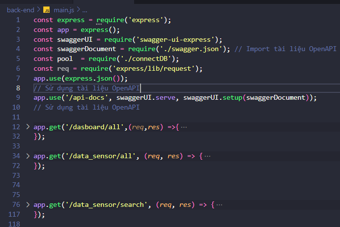
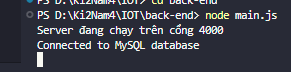
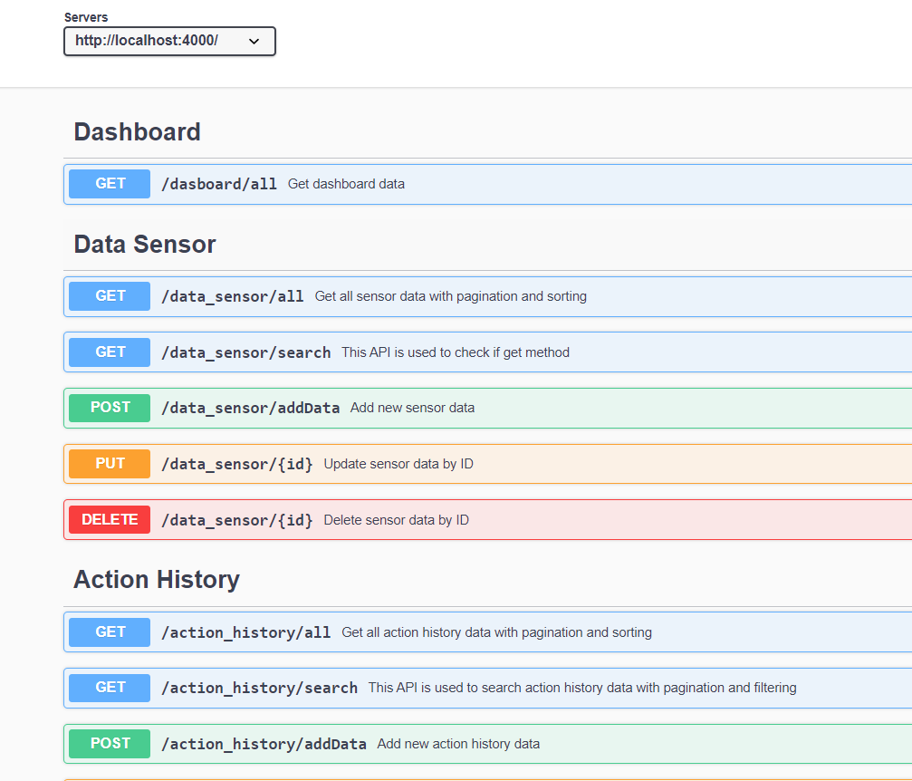

# IOT PROJECT
...
Một dự án IOT với mạch ESP8266 về quản lý nhiệt độ, độ ẩm và ánh sáng, kết hợp với bật tắt 02 thiết bị: đèn và quạt:

- Thông tin về nhiệt độ, độ ẩm và ánh sáng sẽ được cảm biến thu lại ở phần cứng. Sau đó thông tin sẽ được xử lý và hiển thị trực quan hoá trên giao diện website người dùng.
- Người dùng có thể thực hiện chức năng bật/tắt các thiết bị đèn, quạt trên giao diện ứng dụng, các yêu cầu sau đó sẽ được xử lý và gửi về phần cứng để thực hiện yêu cầu.

## Cách SetUp back-end

### Hãy down dự án  về máy để làm theo hướng dẫn

```js
git clone https://github.com/DuyQuandeptrai/GitIOT.git
```

### Bước 1 : Hãy down các thư viện cần thiết cho dự án
- Chuyển đến thư mục làm việc của bạn ví dụ là iot
```js
    cd iot
```
- Sau đó tạo package.json
```js
    npm init -y
```

- Down các thư viện cần thiết
```js
    npm install express nodemon mqtt mysql
```
- Hệ thống sẽ down các file về package.js 

### Bước 2 : Chúng ta tạo 1 file để connect đến database 

- Sửa file trong back-end thành các thông tin về database của mình

```js
    var mysqlConfig = {
    host: 'localhost',
    user: 'root',
    password: 'quan1234',
    database: 'iot'
};
```

### Bước 3: Xử lý logic cho back-end ở thư mục main.js



### Bước 4 chúng ta sẽ chạy project 

```js
node main.js
```

- Server sẽ chạy được ở trên cổng là 4000 



- Chúng ta sẽ truy cập đường link http://localhost:4000/api-docs/ để xem api-docs

- Đây là giao diện chúng ta sẽ nhìn thấy và đã được coi là thành công



## Lưu ý 

- Chúng ta đang kiểm tra trên [Swagger](swagger.io). Hãy đọc thêm tài liệu tham khảo về nodeJS cũng như là MQTT và Swagger để có thể làm dễ dàng hơn.


